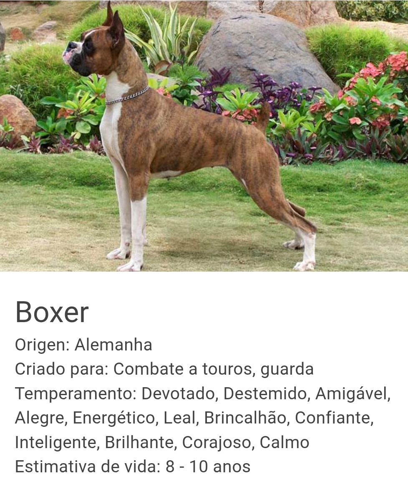

# Raças de cães (Frontend)

> Objetivo da apicação é visualizar informações de raças de cães como foto, nome da raça, temperamento, estimativa de vida e origem.




## 🚀 Rodar projeto frontend

Abrir o terminal no diretório "breeds-dogs-frontend"

Rode este comando no Powershell:

```
php -S localhost:5500 -t public
```

## Abrindo a pagina inicial
No seu navegador insira este link http://localhost:5500/breeds.php para abrir a pagina inicial


## 🤝 Alunos

Aluno que contribuíram para este projeto:

<table>
  <tr>
    <td align="center">
      <a href="#" title="defina o título do link">
        <br>
        <sub>
          <b>Fulano</b>
        </sub>
      </a>
    </td>
    <td align="center">
      <a href="#" title="defina o título do link">
        <br>
        <sub>
          <b>Fulano</b>
        </sub>
      </a>
    </td>
    <td align="center">
      <a href="#" title="defina o título do link">
        <br>
        <sub>
          <b>Fulano</b>
        </sub>
      </a>
    </td>
    <td align="center">
      <a href="#" title="defina o título do link">
        <br>
        <sub>
          <b>Fulano</b>
        </sub>
      </a>
    </td>
  </tr>
</table>
